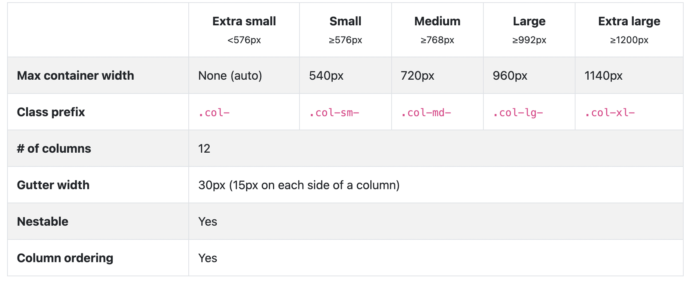

## 부트스트랩은 또 뭘까 ?

- https://getbootstrap.com/docs/4.5/getting-started/introduction/
- 가장 유명한 CSS 프레임워크
- 그럴 듯한 반응형 최신 웹사이트를 빠르게 만들 수 있게 도와줌.

## 부트스트랩 이용법

- 컴퓨터에 다운로드 받은뒤 app.css를 링크할 수도 있음.
- CDN으로 할 수도 있음. -> 콘텐츠 전송 네트워크 혹은 배포 네트워크를 나타냄.
- 부트스트랩중에는 자바스크립트 다루는 부분도 있음. 그래서 자바 스크립트 태그도 붙여야하는데 body 닫기 태그 바로 앞에 넣음.

```html
    <script src="https://code.jquery.com/jquery-3.5.1.slim.min.js"
        integrity="sha384-DfXdz2htPH0lsSSs5nCTpuj/zy4C+OGpamoFVy38MVBnE+IbbVYUew+OrCXaRkfj"
        crossorigin="anonymous"></script>
    <script src="https://cdn.jsdelivr.net/npm/popper.js@1.16.0/dist/umd/popper.min.js"
        integrity="sha384-Q6E9RHvbIyZFJoft+2mJbHaEWldlvI9IOYy5n3zV9zzTtmI3UksdQRVvoxMfooAo"
        crossorigin="anonymous"></script>
    <script src="https://stackpath.bootstrapcdn.com/bootstrap/4.5.0/js/bootstrap.min.js"
        integrity="sha384-OgVRvuATP1z7JjHLkuOU7Xw704+h835Lr+6QL9UvYjZE3Ipu6Tp75j7Bh/kR0JKI"
        crossorigin="anonymous"></script>
```

## 컨테이너

- 부트스트랩에서 가장 기본적인 레이아웃 요소임.
- 콘텐츠를 담고 여백을 설정함.
- 기본적으로 여백을 주고 콘텐츠를 담기 위한 빠른 방법임.
- \<div class="container"> 이런 식으로 container 줌. -> 콘텐츠 주위에 많은 여백이 생김.
- \<div class="container-fluid"> -> 전체 너비 컨테이너가 되어 뷰포트 전체 너비를 차지하게 됨.

## 부트스트랩 버튼

- 버튼을 다루는 작업에는 btn이라는 클래스가 사용됨.
```css
	<button type="button" class="btn btn-primary">Primary</button>
	<button type="button" class="btn btn-success">Success</button>
	<button type="button" class="btn btn-info">Info</button>
	<button class="btn btn-outline-warning">Warning Outline</button>
	<button class="btn btn-outline-danger">Danger Outline</button>
	<button class="btn btn-outline-info btn-lg">Info Outline</button>
	<button class="btn btn-secondary btn-sm">SM Button</button>
	<button type="button" class="btn btn-success" disabled>Success Disabled</button>
```

- \<button type="button" class="btn btn-primary btn-sm">Primary\</button>  -> 작은 버튼
- \<button type="button" class="btn btn-primary btn-lg">Primary\</button>  -> 큰 버튼
- \<button type="button" class="btn btn-primary" disabled>Primary\</button> -> 맨 뒤에 disabled 속성을 추가해서 버튼을 비활성화시킴.
- 꼭 버튼에만 위의 클래스 쓸수 있는거 아님. 다른 요소에다가 쓰면 버튼처럼 생기게 할 수 있음. ex) a태그, input 태그 등등

## 타이포그래피와 유틸리티

- 부트스트랩 홈페이지에서 Content - Typography 페이지. 문서 전체에 걸친 변경 사항을 알려줌.
- display-1, 2, 3, 4 클래스: 큰 헤더를 만드는 데 사용,
- lead 클래스: 단락이 조금 더 돋보임.
- blockquote는 html 요소인데 css에도 blockquote 있음. 약간 더 커짐.
- blockquote-footer 라는 클래스 있는데 이거는 명언쓰고 뒤에 -이름 써져있는것처럼 나옴.
- 텍스트 정렬하는거 쉬움. text-center text-right 등 쓸 수 있음.
- \<h1 class="display-1 text-center text-primary">Bootstrap Playground\</h1> 이런식으로 글자 색깔을 줄 수 있음.
- bg-primary 처럼 배경색을 바꿀 수도 있음.

## 배지

- 카운트나 일종의 레이블을 보여주기 위해 사용됨.
- \<button class="btn btn-primary">Updates <span class="badge badge-light">9\</span>\</button> -> updates 안에 9가 생김.
- \<h2 class="display-4">Buttons \<span class="badge badge-success badge-pill">New\</span>\</h2> -> badge-pill 넣어줘서 badge를 동그란 알약 모양으로 만들어줌,

## 버튼 그룹

- 버튼을 하나의 그룹으로 묶는 기능
- 자바스크립트 필요.

```html
<div class="btn-group" role="group">
  <button class="btn btn-warning">One</button>
  <button class="btn btn-warning">Two</button>
  <button class="btn btn-warning">Three</button>
</div>
```

- 이렇게 하면 세개의 버튼이 하나의 그룹으로 묶여서 나옴.
- 뒤에 role을 써줘서 스크린 리더에게 이게 버튼 그룹이라는 걸 보여줌. 버튼들이 서로 다른 선택지라는 것도 나타냄.

## 경고

- 사용자에게 일종의 피드백을 줌. ex) 권한이 없음. 돌아와서 환영, 로그아웃 됨. 등등

```html
<div class="alert alert-danger alert-dismissible fade show" role="alert">
            <h4 class="alert-heading">Oh No!</h4>
            Danger! You are about to end the world as we know it!
            <button aria-label="Close" class="close" data-dismiss="alert">
                <span aria-hidden="true">&times;</span>
            </button>
</div>
```

- alert-heading 을 줘서 alert 맨위에 큰 글씨로 나타나게 했음.
- &times 는 x 엔티티 코드
- aria-hidden: 항상 등장할 필요 없다는 거 알려줌,
- aria-label: 스크린 리더를 위해 요소 추가하는 거임.
- class="close" 써줘서 x 제대로 나타나게 함.
- data-dismiss="alert" 를 써줘서 x 누르면 사라짐.
- 맨 위에 role 써줘서 스크린리더에게 중요한 거라고 알려줌.
- alert-dismissible fade show 클래스 쓰면 X가 우측 상단 구석으로 옮겨가고 누르면 서서히 사라짐.

## 부트스트랩 그리드 개요

- 그리드 시스템을 통해 부트스트랩을 사용할 때 웹페이지에서 콘텐츠를 배열할 수 있음. 공간 분배를 화면 크기에 따라 달라지게 하는 	반응형 레이아웃을 만들 수 있게 도와줌.
- 컨테이너 클래스 안에서만 그리드 시스템이 작동함. 그리고 row 클래스를 사용해서 행을 만들어야함.

```html
<div class="container">
        <h1 class="display-1 text-center text-primary">The Grid System</h1>
        <div class="row">
            <div class="col-2 bg-success">I AM 2 UNITS</div>
            <div class="col-8 bg-danger">I AM 8 UNITS</div>
            <div class="col-2 bg-success">I AM 2 UNITS</div>
        </div>
/* 이런 식으로 써줌. 12 유닛의 공간을 나눈다. 위의 경우는 2 8 2  공간의 총량은 항상 12*/

        <div class="row">
            <div class="col bg-primary">I AM AUTO SIZED</div>
            <div class="col bg-secondary">I AM AUTO SIZED</div>
            <div class="col-8 bg-primary">I AM AUTO SIZED</div>
        </div>
</div>
/* 이런 식으로 col만 줄 수도 있음.  열에 필요한 공간이 얼마인지 자동으로 계산해서 넣어줌. 위의 경우는 4유닛의 공간이 남아서 2씩 나눠서 들어감. */

```

- 컨테이너 안에 컨테이너 중첩 시킬 수도 있음. 근데 또 row 클래스를 만들어야함.

## 반응형 부트스트랩 그리드



```html
<div class="row">
	<div class="col-md-6 col-xl-3 bg-info">
			Lorem ipsum dolor sit amet consectetur adipisicing elit. Dolor consequatur voluptatem eligendi ducimus.
			Expedita quia omnis, at itaque illo nemo dolorem aperiam. Rerum magnam eveniet dicta vel rem dolorem
			voluptatem.
	</div>
	<div class="col-md-6 col-xl-3 bg-success">
			Lorem ipsum dolor sit amet consectetur adipisicing elit. Dolor consequatur voluptatem eligendi ducimus.
			Expedita quia omnis, at itaque illo nemo dolorem aperiam. Rerum magnam eveniet dicta vel rem dolorem
			voluptatem.
	</div>
	<div class="col-md-6 col-xl-3 bg-info">
			Lorem ipsum dolor sit amet consectetur adipisicing elit. Dolor consequatur voluptatem eligendi ducimus.
			Expedita quia omnis, at itaque illo nemo dolorem aperiam. Rerum magnam eveniet dicta vel rem dolorem
			voluptatem.
	</div>
	<div class="col-md-6 col-xl-3 bg-success">
			Lorem ipsum dolor sit amet consectetur adipisicing elit. Dolor consequatur voluptatem eligendi ducimus.
			Expedita quia omnis, at itaque illo nemo dolorem aperiam. Rerum magnam eveniet dicta vel rem dolorem
			voluptatem.
	</div>
</div>

```

- 위의 예시는 md 사이즈가 되는 순간 6유닛씩 잡고 xl 사이즈가 되는 순간 3유닛이 된다는 것을 의미 그래서 xl이상의 사이즈에는 모든 글이 다 모여 있음.

```html
<div class="row">
            <div class="col-xl-4 col-md-6">
                
            </div>
</div>
```

- 위의 예시처럼 img-fluid 써주면 포함하고 있는 요소의 크기에 따라 이미지의 크기를 조정함. 가변 이미지임.
- row 클래스 써주는 곳에 no-gutters 클래스를 추가해주면 사이의 간격이 제거됨.

## 유용한 그리드 유틸리티

```html
<div class="row border justify-content-center justify-content-lg-start justify-content-xl-between">
	<div class="col-md-4 bg-primary">
			Lorem, ipsum dolor sit amet consectetur adipisicing elit. Neque, vero iure provident, officia saepe
			soluta accusantium repellat sunt repellendus fugit iste deleniti, blanditiis eveniet hic quas a ipsa
			amet dolore?
	</div>
	<div class="col-md-4 bg-info">
			Lorem, ipsum dolor sit amet consectetur adipisicing elit. Neque, vero iure provident, officia saepe
			soluta accusantium repellat sunt repellendus fugit iste deleniti, blanditiis eveniet hic quas a ipsa
			amet dolore?
	</div>
</div>

```

- flexbox 쓸때 썼었던 속성 등을 쓸 수 있는 클래스가 있음.
- align-items-start, align-items-center, align-items-end : 컨텐츠를 수직 정렬 할 때 적용할 수 있는 옵션
- align-self-start, align-self-center, align-self-end 이것도 가능
- justify-content-start, justify-content-center, justify-content-end, justify-content-between, justify-content-around 등이 있음.
- 위의 예시처럼 lg이상이면 start xl 이상이면 between 이런 식으로 줄 수도 있음.

## 부트스트랩과 폼

- 폼 요소 꾸미는 작업 일반적으로 귀찮은데 부트스트랩을 이용하면 간단함.
- input 태그에 form-control 적용하면 더 보기 좋은 입력 형태 만들 수 있음.
- 그룹화한 form-group을 최상위로 써준다. 이걸 써줘야지 통일성이 유지되고 여백이 깔끔함. 예시 맨 뒤에 button에도 form-group 써준 것을 확인할 수 있음.
- custom-checkbox로 체크박스 예쁘게 만들 수 있음.
- form-row 태그는 row 태그와 유사한데 폼 사이의 공간을 줄이도록 기본 간격 값을 조정함.
- form-group을 넣어줘야 깔끔해짐. 자주 넣자.

```html
<form action="#nowhere">
	<div class="form-row">
			<div class="form-group col-md-6">
					<label for="email">Email</label>
					<input type="email" class="form-control" id="email" placeholder="Email">
			</div>
			<div class="form-group col-md-6">
					<label for="password">Password</label>
					<input type="password" class="form-control" id="password" placeholder="password">
			</div>
	</div>
	<div class="form-group">
			<label for="address">Street Address</label>
			<input type="text" class="form-control" id="address" placeholder="923 Chicken Ranch St">
	</div>
	<div class="form-row">
			<div class="form-group col-md-6">
					<label for="city">City</label>
					<input type="text" class="form-control" id="city">
			</div>
			<div class="form-group col-md-3 col-6">
					<label for="state">State</label>
					<select class="form-control" name="state" id="state">
							<option value="AL">Alabama</option>
							<option value="AK">Alaska</option>
					</select>
			</div>
			<div class="form-group col-md-3 col-6">
					<label for="zip">Zip Code</label>
					<input type="text" class="form-control" id="zip">
			</div>
	</div>
	<div class="form-group">
			<div class="custom-control custom-checkbox">
					<input type="checkbox" class="custom-control-input" id="tos">
					<label class="custom-control-label" for="tos">Sign Me Up</label>
			</div>
	</div>

	<button type="submit" class="btn btn-success">Register</button>
</form>
```

## 네비게이션 바

- 대표적인 부트스트랩 컴포넌트 가장 중요한 컴포넌트 중 하나
- 모든 웹사이트가 사용함.
- 문법을 외울 수는 없음. 거의 docs 보고 한다고 생각해야함.
- navbar-dark, navbar-light 쓰면 네비게이션 바의 문자를 바꿈.
- collapse 써주면 요소 숨겨짐. navbar-expand-lg 쓰면 lg일 때 collapse 안됨.
- 햄버거버튼 만들기. 이거는 그냥 보고 하기. navbar-toggler 써주고 data-target으로 연결해줘야됨. 밑에 예시에서는 #expandme 로 연결
- fixed-top으로 navbar 상단에 고정시킬수 있음. sticky-top 으로 하면 navbar 위에도 글 쓸수 있음.

```html
<nav class="navbar navbar-expand-sm navbar-dark bg-primary fixed-top">
        <a class="navbar-brand" href="#">Navbar</a>
        <button class="navbar-toggler" data-toggle="collapse" data-target="#expandme">
            <span class="navbar-toggler-icon"></span>
        </button>
        <div class="collapse navbar-collapse" id="expandme">
            <div class="navbar-nav">
                <a href="Home" class="nav-item nav-link">Home</a>
                <a href="Home" class="nav-item nav-link">About</a>
                <a href="Home" class="nav-item nav-link">Contact</a>
            </div>
            <form class="form-inline ml-auto">
                <input class="form-control mr-sm-2" type="search" placeholder="Search" aria-label="Search">
                <button class="btn btn-outline-light my-2 my-sm-0" type="submit">Search</button>
            </form>
        </div>
    </nav>
```

## 부트스트랩 아이콘

- 부트스트랩 홈페이지에서 아이콘으로 볼 수 있음. 복사해서 쓰면됨.
- SVG 스케일러블 벡터 그래픽임.

```html
<div class="row">
            <div class="col-md-4">
                <div class="input-group">
                    <div class="input-group-prepend">
                        <span class="input-group-text"><svg width="1em" height="1em" viewBox="0 0 16 16"
                                class="bi bi-search" fill="currentColor" xmlns="http://www.w3.org/2000/svg">
                                <path fill-rule="evenodd"
                                    d="M10.442 10.442a1 1 0 0 1 1.415 0l3.85 3.85a1 1 0 0 1-1.414 1.415l-3.85-3.85a1 1 0 0 1 0-1.415z" />
                                <path fill-rule="evenodd"
                                    d="M6.5 12a5.5 5.5 0 1 0 0-11 5.5 5.5 0 0 0 0 11zM13 6.5a6.5 6.5 0 1 1-13 0 6.5 6.5 0 0 1 13 0z" />
                            </svg></span>
                    </div>
                    <input type="text" class="form-control" placeholder="Search">
                </div>
            </div>
        </div>
```
- 이런 식으로 쓸 수 있음. 이렇게 쓰면 진짜 쓰는 칸처럼 보임.
- Font awesome 이란 사이트도 괜찮 근데 유료인 부분도 있음.

## 기타 부트스트랩 유틸리티

- 전체적인거는 공식 문서 보기.
- border-right border top 이런 식으로 줄 수 있음. border-primary등으로 색깔 넣을 수도 있고 border-0을 넣어서 모든 테두리 없앨 수도 있음.
- rounded 쓰면 테두리 깎기도 됨.
- shadow도 있음.
- 여백이나 패딩 넣을 수도 있음. mt-0 == margin top size 0 pt-0 == padding top size 0
- size는 0부터 5까지 있음. 미리 정해진 $spacer의 배수임.
- p-3 모든 곳에 패딩 넣어라. p-sm-1 이런 식으로 사이즈에 따라 패딩 넣을 수도 있음.
- display특성 중에는 none 생각보다 유용.

## 기타 부트스트랩 요소
- card 진짜 자주 쓰임.
- 캐러셀 이것도 자주 쓰임. 슬라이더 만드는 거임.
- 드롬다운도 있음.
- Modal은 대화창 띄우는 도구,