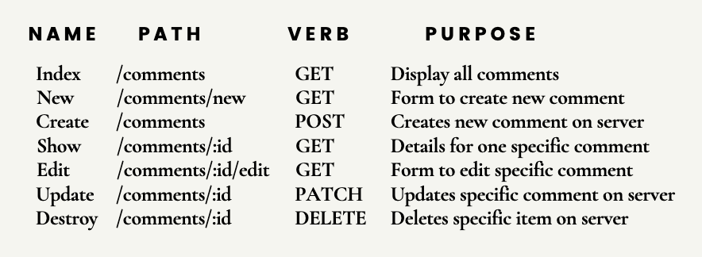

## GET 요청과 POST 요청

- GET 요청

  - 대부분 정보를 가져올 때씀.
  - 요청을 보낼 때 같이 따라오는 데이터가 있으면 쿼리 문자열에 담김.
  - URL 최대 길이는 2048자. GET으로 보낼 데이터는 한정되어 있음.
  - 생성하거나 편집하고 업데이트하는 데이터를 전송하는 건 아니니까 백엔드까지 영향을 주는 거는 아님.

- POST 요청
  - 정보를 올리거나 보낼 때 씀. (생성 삭제 업데이트)
  - 길이가 제한된 URL과 달리 더 많은 데이터를 보낼 수 있음.
  - JSON 타입으로도 보낼 수 있고 텍스트로 취급함.
  - 데이터를 제출하여 request body에 포함.

## Express Post 경로 정의하기

- 아래 예시에서 method에 따라 get post 나눌 수 있는 거 확인.

```html
<h2>GET</h2>
<form action="http://localhost:3000/tacos" method="get">
  <input type="text" name="meat" />
  <input type="number" name="qty" />
  <button>Submit</button>
</form>
<h2>POST</h2>
<form action="http://localhost:3000/tacos" method="post">
  <input type="text" name="meat" />
  <input type="number" name="qty" />
  <button>Submit</button>
</form>
```

```js
app.get("/tacos", (req, res) => {
  res.send("GET /tacos response");
});

app.post("/tacos", (req, res) => {
  res.send(`POST /tacos response`);
});
```

## 요청 구문 분석하기

- post로 보낸 데이터를 request body를 통해 추출 할 수 있음.
- 쿼리 문자열은 req.query에 포함됨.
- 포스트는 req.body에 특성이 들어 있음.
- 아래 html에서 입력 넣고 적으면 console.log(req.body); 했을 때 undefined 뜸.
- 실제로는 있음. 근데 req.body는 기본적으로 정의되지 않으며 분석 미들웨어 사용 시 추가됨.
- postman에서 body 누르면 form-data form-urlencoded 이진법 순수 텍스트, JSON과 HTML 등 여러가지 포맷 있음. 이 포맷에 따라 실제 전송 방식과 암호화 방식이 다름.
- 미들웨어 사용은 express에게 request body를 분석할 방법을 적는거임.
- app.use(express.urlencoded({ extended: true })): url 암호화 데이터로 분석할 미들웨어 사용해라. 이제 postman에서 x-www-form-urlencoded로 보낼 수도 있고 버튼 눌러도 req.body가 뜸.
- app.use(express.json()): json데이터를 request body에서 분석하게 하기위해 express한테 말해줌.

```html
<form action="http://localhost:3000/tacos" method="post">
  <input type="text" name="meat" />
  <input type="number" name="qty" />
  <button>Submit</button>
</form>
```

```js
app.post("/tacos", (req, res) => {
  console.log(req.body);
  res.send(`POST /tacos response`);
});
```

## REST: representational state transfer

- 분산 하이퍼미디어 시스템의 아키텍처 스타일 혹은 패러다임
- 클라이언트와 서버가 어떻게 소통해야하는가에 대한 가이드라인, 개념, 원리
- RESTful은 이 REST규칙에 따르는 시스템
- 최소한 대부분 시스템은 HTTP 동사와 매치되는 일종의 일관된 url패턴으로 구성되어 있음.
- 기본 URL과 다른 HTTP 메서드를 결합하여 CRUD Operation을 노출 하는 거임.
- 특징
  - 자원: REST에서 모든 것은 자원으로 간주됨.
  - 표현: 자원은 클라이언트와 서버 간에 JSON, XML, HTML 등 다양한 형식으로 표현되어 전송. 클라이언트는 서버로부터 자원의 상태나 데이터를 요청하고, 서버는 이를 특정 형식으로 응답
  - 무상태성: 서버는 클라이언트의 상태를 저장하지 않음.
  - HTTP 메소드 활용: REST는 HTTP 메서드를 활용해 자원을 조작함.
  - 계층화된 시스템: 클라이언트와 서버 사이에 프록시나 게이트웨이 같은 계층을 추가할 수 있음.
  - 캐싱 가능: 응답 데이터는 캐싱될 수 있어야 함.
  - 통합된 인터페이스: REST는 일관된 방식으로 자원에 접근하고 조작할 수 있도록 설계됨.

## RESTful comments 만들기.

- RESTful API 구현하는 방법은 하나가 아님.
- 예시

  

- RESTful index
  - comments/ 들어오면 확인 가능

```html
<!-- index.ejs -->
<h1>Comments</h1>
<ul>
  <% for(let c of comments) {%>
  <li><%=c.comment%> - <b><%=c.username%></b></li>
  <% }%>
</ul>
```

```js
app.get("/comments", (req, res) => {
  res.render("comments/index", { comments });
});
```

- RESTful new
  - /comments/new 페이지에서 submit 하면 /comments post로 가서 comments에 추가함. 그리고 /comments get하면 index.ejs렌더링 하는데 추가된거 확인 가능

```html
<!-- new.ejs -->
<form action="/comments" method="post">
  <section>
    <label for="username">Enter username:</label>
    <input type="text" id="username" placeholder="username" name="username" />
  </section>
  <section>
    <label for="comment">Comment Text</label>
    <br />
    <textarea id="comment" cols="30" rows="5" name="comment"></textarea>
  </section>
  <button>Submit</button>
</form>
```

```js
// index.js
app.get("/comments/new", (req, res) => {
  res.render("comments/new");
});

app.post("/comments", (req, res) => {
  const { username, comment } = req.body;
  comments.push({ username, comment });
  res.send("It worked");
});
```

## Express redirect

- 위 상태에서는 new에서 submit하고 It worked 뜬 상태에서 새로고침 누르면 다시 post 요청보내져서 댓글 추가됨.
- redirect로 전환 가능. res.redirect('/comments'); 추가
- /comments get으로 데려감. 이 때 Network 탭 눌러보면 302상태코드 나와서 리다이렉트되고 /comments라는 헤더 포함된거 확인 가능 그리고 /comments get 요청을 전송해서 나오게 된거임. 즉 두개의 응답이 있었다.

```js
app.post("/comments", (req, res) => {
  const { username, comment } = req.body;
  comments.push({ username, comment, id: uuid() });
  res.redirect("/comments");
});
```

## RESTful detail

```js
app.get("/comments/:id", (req, res) => {
  const { id } = req.params;
  const comment = comments.find((c) => c.id === parseInt(id));
  res.render("comments/show", { comment });
});
```

```html
<!-- show.ejs -->
<h1>Comment id: <%= comment.id %></h1>
<h2><%= comment.comment %> - <%=comment.username %></h2>
<a href="/comments">Back to index</a>
```

- index.ejs도 변경 comment마다 그 디테일 페이지 들어갈 수 있게 a태크 추가

```html
<!-- index.ejs -->
<ul>
  <% for(let c of comments) {%>
  <li>
    <%=c.comment%> - <b><%=c.username%></b>
    <a href="/comments/<%= c.id %>">details</a>
  </li>
  <% }%>
</ul>
<a href="/comments/new">New Comment</a>
```

## uuid 패키지

- 예시와 같이 id 1 2 3 이렇게 그냥 쓰면 어려움.
- uuid 패키지 이용. npm i uuid
- const { v4: uuid } = require('uuid'); 하고 uuid() 쓰면 자동으로 들어감.
- comments id도 uuid()로 받고 post로 comments push 할때도 comments.push({ username, comment, id: uuid() })로 바꿔주기

## RESTful update

- patch랑 put 모두 업데이트와 관련있음.
- put은 전체를 포함하는 본문 요구하고 patch는 부분 요구함. 전체 수정과 부분 수정 차이임.

```js
app.patch("/comments/:id", (req, res) => {
  const { id } = req.params;
  const foundComment = comments.find((c) => c.id === id);

  //get new text from req.body
  const newCommentText = req.body.comment;
  //update the comment with the data from req.body:
  foundComment.comment = newCommentText;
  //redirect back to index (or wherever you want)
  res.redirect("/comments");
});
```

## method overriding

- HTML 폼은 get이나 post요청만 전송할 수 있음.
- edit 페이지 만듬

```js
app.get("/comments/:id/edit", (req, res) => {
  const { id } = req.params;
  const comment = comments.find((c) => c.id === id);
  res.render("comments/edit", { comment });
});
```

```html
<!-- edit.ejs -->
<form method="POST" action="/comments/<%=comment.id%>?_method=PATCH">
  <textarea name="comment" id="" cols="30" rows="10">
<%= comment.comment %></textarea
  >
  <button>Save</button>
</form>
```

- method-override로 아까의 문제를 해결함. npm i method-override
- const methodOverride = require('method-override')
- app.use(methodOverride('\_method')) 써줌. 안겹치기위해 \_method 이름 썼고 ? 뒤에 = PATCH 이런 식으로 써주면 됨.
- \<form method="POST" action="/comments/<%\=comment.id%>?\_method=PATCH"> post 요청을 전송하는 거지만 express를 속여서 patch 요청이라고 생각하게 만드는 거임.

## RESTful delete

- patch랑 똑같은 방식으로 express delete로 속이기

```html
<!-- show.ejs -->
<form method="POST" action="/comments/<%= comment.id %>?_method=DELETE">
  <button>Delete</button>
</form>
```

```js
app.delete("/comments/:id", (req, res) => {
  const { id } = req.params;
  comments = comments.filter((c) => c.id !== id);
  res.redirect("/comments");
});
```
