## 데이터베이스

- 정보를 저장해서 지속시킬 방법이 필요함. 이게 데이터베이스의 역할
- 뿐만 아니라 많은 데이터를 효율적으로 저장하고 압출하여 관리하기 쉽고 접속하기 쉽게 만들어줌.
- 데이터베이스관리 시스템이라고 보안 기능이나 관리자로서의 접속을 누구에게 허용할지 제어하는 기능이 있음.

## SQL 데이터베이스, NOSQL 데이터베이스

- SQL 데이터베이스: mysql, postgres, sqlite, oracle, microsoft SQL Server 등

  - 구조화된 쿼리언어, 즉 관계형 데이트베이스임. SQL에서 하는 모든 일이 테이블에서 이루어짐
  - 스키마와 테이블을 세팅한 후에야 데이터베이스에 뭔가 추가할 수 있음.

- NOSQL 데이터베이스: MongoDB, Redis, Couch DB, Neo4j, Cassandra 등
  - 구조화된 쿼리 언어를 쓰지 않음. 포괄적인 그룹
  - 유형 다양함. (문서 데이터 저장소, 키 값 저장소, graph 저장소 등)

## Mongo를 배워야하는 이유

- MEAN 스택이나 MERN스택이나 존재. 여기서 M이 몽고임.
- JS로 시작한 경우 더욱 더 쉽게 배울 수 있음.
- 문서 데이터베이스여서 어려운 구문을 새로 배울 필요 없음.
- brew services start mongodb-community@8.0로 시작(맥)

## mongo shell

- mongosh로 mongo shell 킴.
- javascript shell이라 javascript 코드를 입력할 수 있음.
- db입력하면 연결되어있는 데이터 베이스 볼 수 있음. 처음은 test라는 데이터 베이스
- show databases로 데이터 베이스 볼 수 있음.
- use + 데이터베이스 이름으로 데이터베이스 생성. 기존에 이름에 해당하는 데이터베이스가 없으면 생성 후 전환. 있으면 그냥 그 데이터베이스로 이동함.

## BSON 이란

- Mongo가 기대하는 종류의 정보가 BSON임.
- 기존 JSON은 너무 느림. 텍스트 기반이며 파싱이 느림. 공간 효율성도 안 좋음.
- BSON은 이진법 JSON임. mongo는 이를 이진법으로 저장. 훨씬 메모리 덜 차지함.
- json은 string, boolean, number, array 유형의 데이터 지원. BSON은 추가로 Date, Raw, Binary 등 지원함.

## Mongo 데이터베이스에 삽입하기.

- use animalShelter로 데이터베이스 만들기.
- 집합 만들기. 무언가 삽입하면 집합이 만들어짐. 세가지 방법 있음. insertOne, insertMany, insert. 웬만하면 insert 씀. insertOne은 집합에 작성될 한 가지 혹은 하나의 객체만을 전달함.
- show collections으로 데이터 삽입하려는 집합 확인 가능. 집합 사용하면 조회할 수 있음.
- db.dogs.insertOne({name: "Charlie", age: 3, breed: "corgi", catFriendly:true})

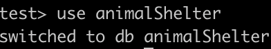

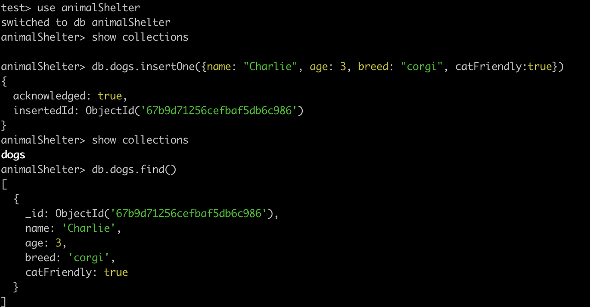

- 보면 \_id부분이 삽입됨. 고유한 값임. 기본 키로 알려져 있음. 삽입된 문서가 \_id 빠뜨리면 MongoDB 드라이버가 objectId를 자동 생성함.
- ObjectId는 Mongo에서 특정 유형임. 작고 고유하며 값을 생성하는 것이 빠름.
- db.dogs.insert([{name: "Wyatt", breed: "Golden", age:14, catFriendly:false}, {name: "Tonya", breed: "Chihuahua", age:17, catFriendly:false}]) 여러개 삽입한거 확인
- db.cats.insert({name: "Blue Steele", age: 7, dogFriendly: false, breed: "Scottish fold"}) 한개만 넣을 수도 있음. 이래서 거의 insert만 씀.
  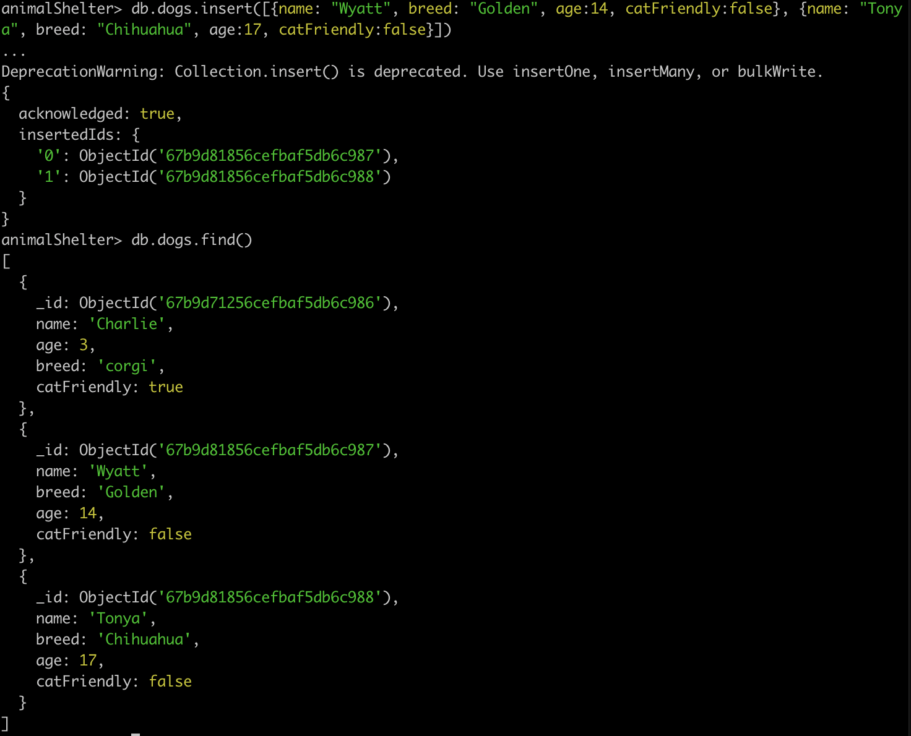
- 예시는 구조 맞췄지만 꼭 구조 맞출 필요 없음.
  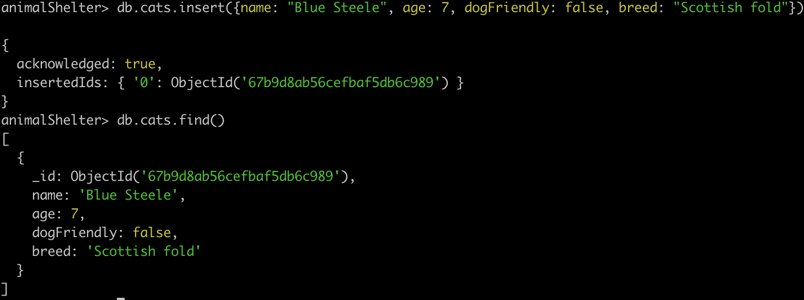
- 다른 데이터베이스에서 db.cats.find() 하면 안나옴.
- 결론: db.collections.insert 으로 하나 혹은 다수의 문서를 넣을 수 있고 집합이 존재하지 않는다면 생성 후 추가, 있었으면 기존 집합에 추가. \_id 안 넣으면 자동으로 생성됨.

## Mongo 데이터베이스에서 찾기

- db.dogs.find() 이런 식을로 찾음. 중괄호에 객체 넣을 수 있음. 이건 선택사항. 그냥 db.dogs.find() 는 db.dogs.find({}) 라고 생각하면 됨.
  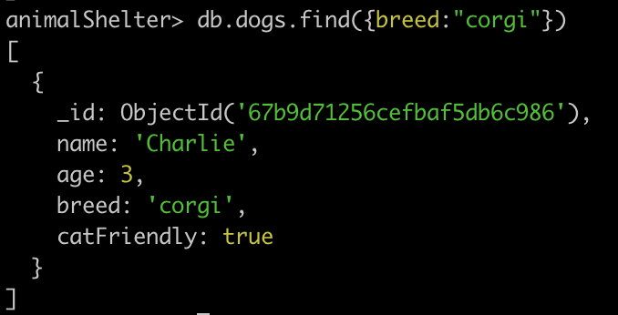
  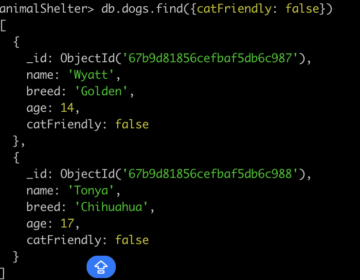

- 결과가 하나만 나오길 원하면 findOne 쓰면됨.
  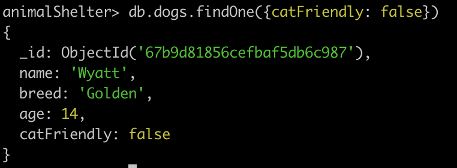
- find는 커서 반환. 결과의 참조임. 수천 개의 다른 결과가 있을 경우 find로 쿼리 만들 수 있음.
- findOne은 실제 문서 반환.

## Mongo 데이터베이스 업데이트하기.

- 방법으로 updateOne, updateMany, replaceOne 있음.
- undateOne 일치하는 첫 항목만 업데이트, updateMany는 일치하는거 모두 업데이트
- 첫번째 인수에 매치하는 조건 쓰고 두번째 인수에 업데이트 어떻게 할건지 씀. 근데 이때 원자적 연산자(\$)있어야 함. Mongo에서 업데이트 호출할 때 특수 연산자 사용해야하는데 흔하게 사용되는 것이 $set임.
  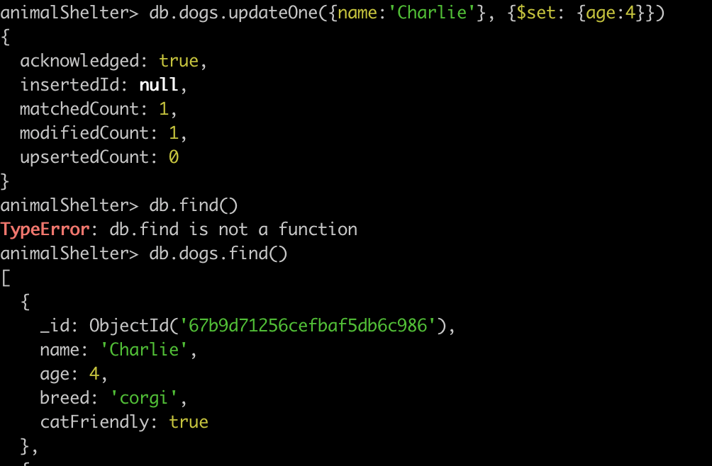
- 현재 없는거 업데이트하면 새로운 키 값이 생김.
  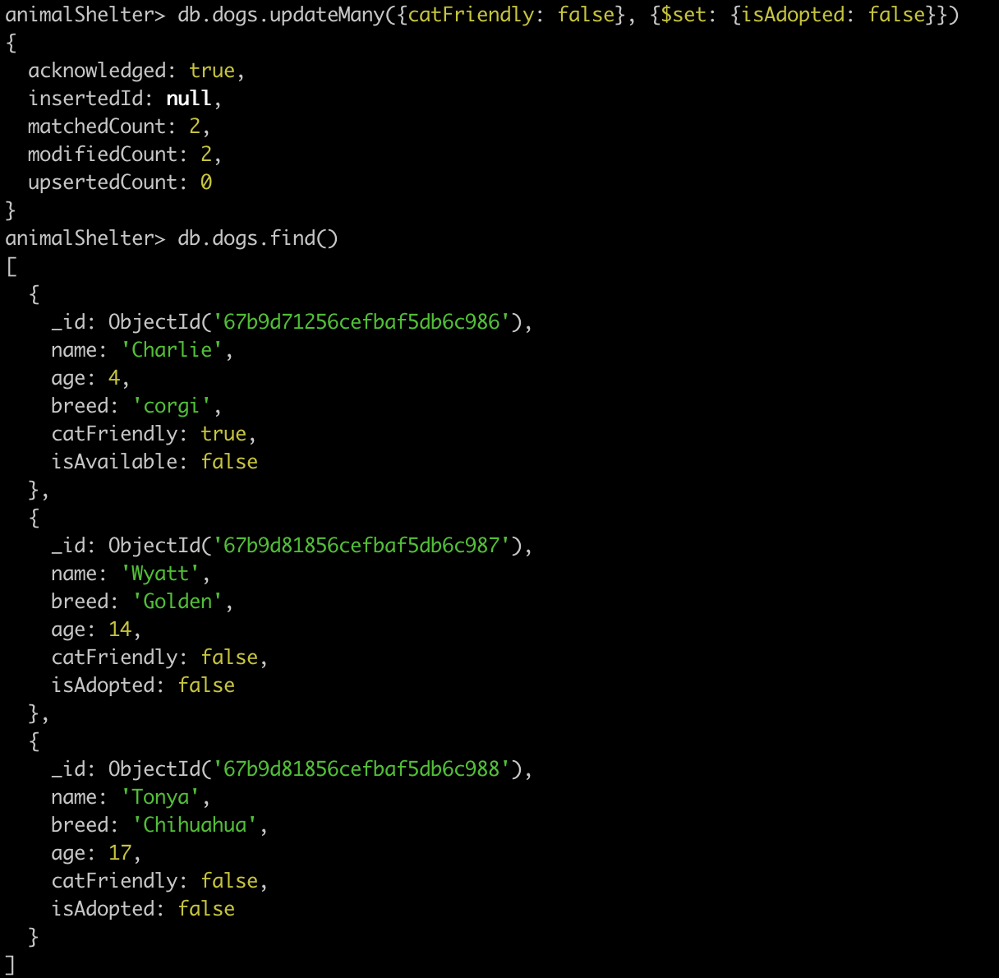
- \$set외에도 다양한 연산자 있음. $currentDate는 문서에 현재 날짜를 설정할 때 사용함.
  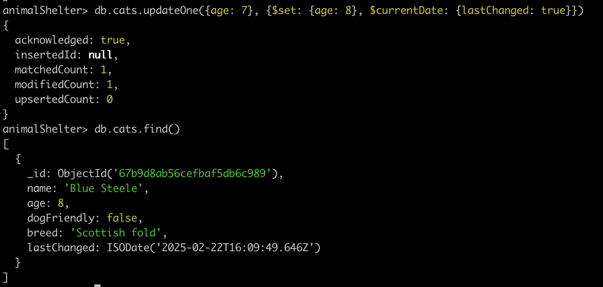
- replaceOne은 문서의 특정 내용을 완전히 대체함. ex) 고양이 Blue의 ID는 유지하면서 값을 추가하거나 수정하지 않고 모든 것을 대체하고 싶을 때 사용

## Mongo 데이터베이스 삭제하기.

- deleteMany, deleteOne 있음.
  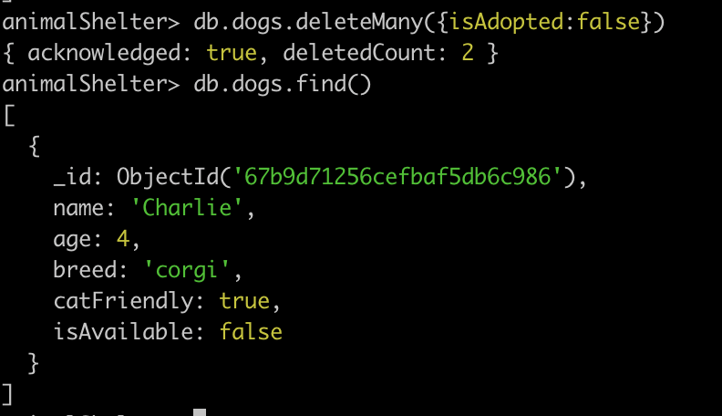
- db.dogs.deleteMany({}) 이렇게 다 지울 수도 있음.
- 그리고 연산자들을 이용해서 조건 줘서 지우기 가능. ex) 20살 이상 등등

## 기타 mongo 연산자

- find 했을때 `{"personality": {"catFriendly" : true, "childFriendly": true}` 이런 식으로 나와있을 때 `db.dogs.find({'personality.childFriendly': true})` 이런 식으로 검색 가능
- mongo는 어려운 수학을 내포한 많은 기능들을 제공함.
- `db.dogs.find({age: {$gt: 8}})` 이런식으로 8 보다 큰 개들 찾을 수도 있음. gte는 8 이상.
- `db.dogs.find({breed: {$in: ['Mutt', 'Corgi']}})` in을 써서 배열에 있는 breed 인 것만 찾아서 쓸 수 있음.
- `db.dogs.find({breed: {$in: ['Mutt', 'Corgi']}, age: {$gt: 8}})` 이렇게 여러 조건을 넣어줄수도 있음.
- `$ne` 는 not equals 다른거 찾기.
- `$nin` not in 해당 되지 않는 조건들 찾기.
- `db.dogs.find({$or: [{'personality.catFriendly': true}, {age: ${lte: 2}}]})` catFriendly가 true 거나 age가 2세 이상인 것들을 뽑아줌. 당연히 `$and`도 쓸 수 있음.
