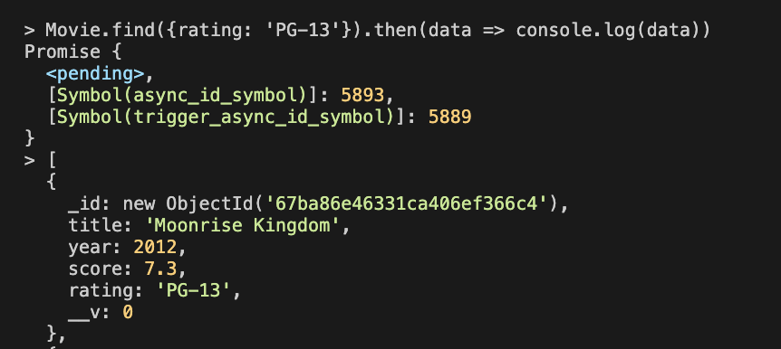

## Mongoose란

- 지금까지 Shell을 사용해서 데이터베이스와 상호작용했는데 대부분 이런식으로 데이터베이스 사용하지 않음. 애플리케이션으로 데이터베이스와 상호작용
- mongo에 여러 드라이버 있음. 다른 프로그래밍 언어를 mongo와 연결해줌.
- mongoose라는 툴 쓸거임. ODM 객체 데이터 매퍼임. mongoose는 mongo와 node.js 둘을 연결해줌.
- 드라이버 역할도 하지만 js측면에서 유용한 기능 제공. 회신 데이터와 mongo에 삽입하려는 데이터를 매핑하여 메서드를 추가할 수 있는 사용가능한 JavaScript 객체로 만듬.
- SQL 데이터베이스는 이런 소프트웨어를 ORM이라고 부름.

## Mongo에 Mongoose 연결하기

- npm i moongoose
- mongo 기본 port는 27017임. .connect("mongodb://127.0.0.1:27017/test")에서 /test는 test데이터베이스 쓴다는 이야기임.
- mongoose는 Promises도 지원함. then catch 가능. 아래와 같이 index.js 만든 후 node index.js하면 연결됨.

```js
const mongoose = require("mongoose");
mongoose
  .connect("mongodb://127.0.0.1:27017/movieApp")
  .then(() => {
    console.log("CONNECTION OPEN!!");
  })
  .catch((e) => {
    console.log("OH NO ERROR!");
    console.log(e);
  });
```

## 첫번째 mongoose 모델

- mongoose의 핵심 목표는 JS에서 mongoDB와 더 쉽게 상호작용하기 위함.
- 모델은 mongoose의 도움으로 생성되는 JS의 클래스로 MongoDB의 정보를 나타내며 구체적으로 어떤 집합의 정보를 나타냄.
- 스키마는 Mongo의 각기 다른 키 집합을 JS의 다른 타입으로 구조 짜는 것을 말함.
- 데이터 타입을 스키마를 정의함으로써 구체화함. 스키마를 정의하는 걸로는 데이터베이스에 영향 주지 않음.
- 타입은 문자열, 숫자, 날짜, 불리언, 객체 ID, 배열, 버퍼 등이 있음.

- movieSchema 생성

  ```js
  const movieSchema = new mongoose.Schema({
    title: String,
    year: Number,
    score: Number,
    rating: String,
  });
  ```

- 스키마 가져와서 모델 만듬. 모델이름은 단수형이여야함. 첫번째문자는 대문자여야함. 그럼 mongoose는 movies처럼 복수형으로 집합을 자동 생성함.
  ```js
  const Movie = mongoose.model("Movie", movieSchema);
  ```
- 이제 새로운 인스턴스 만들 수 있음.

  ```js
  const amadeus = new Movie({
    titel: "Amadeus",
    year: 1986,
    score: 9.2,
    rating: "R",
  });
  ```

- Terminal에서 가져오기.
  

- mongoshell에서 확인. amadeus.save()를 해야지 인스턴스 확인 할 수 있음. amadeus.score = 9.5 처럼 값 바꾸고도 amadeus.save()해야함.
  

- 주의해야할점: mongoose.connect 할 때 데이터 베이스 이름 잘 적어야함.
- save를 포함한 다양한 메서드를 배울거임.

## 대량 삽입하기.

- 단일 삽입으로 amadeus 넣었을 때는 amadeus.save()했어야함.

```js
const amadeus = new Movie({
  title: "Amadeus",
  year: 1986,
  score: 9.2,
  rating: "R",
});
```

- insertMany 메소드로 여러개 한꺼번에 넣을 수 있음. 저장할 필요 없이 자동 저장

```js
Movie.insertMany([
  { title: "Amelie", year: 2001, score: 8.3, rating: "R" },
  { title: "Alien", year: 1979, score: 8.1, rating: "R" },
  { title: "The Iron Giant", year: 1999, score: 7.5, rating: "PG" },
  { title: "Stand By Me", year: 1986, score: 8.6, rating: "R" },
  { title: "Moonrise Kingdom", year: 2012, score: 7.3, rating: "PG-13" },
]).then((data) => {
  console.log("IT WORKED!");
  console.log(data);
});
```


## Mongoose로 찾기

- find, findById 메서드 등이 있음.
- find는 mongo에서 찾기 사용했던거와 비슷하게 쿼리와 키-값 쌍 구문 전달.
- Promise처럼 받은 결과를 처리하는데 Promise랑은 다름. Mongoose쿼리라고 부름. then 있음.
- Movie.find({}) 하면 thenable 객체 뜸.
  
- Movie.find({}).then(data => console.log(data))
  
- Movie.find({rating: 'PG-13'}).then(data => console.log(data))
  
  
- findOne도 똑같음/ 하나만 찾음. 근데 find 처럼 배열이 아니라 객체로 나옴.
- find 콜백함수의 첫번째 매개변수는 오류고 두번째 매개변수는 우리가 얻는 데이터임.
- findById는 Id로 찾아줌.
  
- then 대신 exec 메서드 쓰는게 좋음. 이건 완전한 promise 반환

## Mongoose로 업데이트하기.

- updateOne: 하나 업데이트. 처음이 조건 두번째가 바꾸는거
  
- updateMany: 여러개 한꺼번에 업데이트
  
- 예시에서 확인하다 싶이 반환 값이 변환된 데이터 뽑아주지는 않음. 그냥 몇개 수정되었나 이런거 반환해줌.
- findByIdAndUpdate, findOneAndUpdate등으로 반환된 값 돌려줄 수 있음.
  
- 보면 7.0으로 바뀌었는데 안 바뀐거 확인할 수 있음. 실제로는 바뀌었음. 바뀐 새 버전이 표시되게 만들고 싶을 경우 세 번째 옵션으로 {new: true} 주면 됨

## Mongoose로 삭제하기.

- remove, findOneAndRemove, findByIdAndRemove, deleteOne, deleteMany, findOneAndDelete, findByIdAndDelete
  

## Mongoose 스키마 유효성 검사

- 기존

  ```js
  const productSchema = new mongoose.Schema({
    name: String;
  })
  ```

- 개선: 구문에 정보 더 넣을 수 있고 내장 유효성 검사가 따라옴.

  ```js
  const productSchema = new mongoose.Schema({
    name: {
      type: String,
      required: true,
    },
  });
  ```

- required 쓰면 무조건 name 써줘야함.

```js
const Product = mongoose.model("Product", productSchema);

const bike = new Product({ name: "Mountain Bike", price: 599 });
bike
  .save()
  .then((data) => {
    console.log("IT WORKED");
    console.log(data);
  })
  .catch((err) => {
    console.log("OH NO ERROR");
    console.log(err);
  });
```

- 만약 const bike = new Product({ name: "Mountain Bike", price: 599, color:'red' });같이 엉뚱한 값을 넣었도 알아서 color: 'red' 무시함.

## 추가 스키마 제약 조건

- default 값을 넣어줄수도 있음.

  ```js
  const productSchema = new mongoose.Schema({
    name: {
      type: String,
      required: true,
    },
    price: {
      type: Number,
    },
    onSale: {
      type: Boolean,
      default: false,
    },
  });
  ```

- 개별 타입에 넣을 수 있는 제약조건도 있음. ex) String에 lowercase trim match 등

```js
name: {
        type: String,
        required: true,
        maxlength: 20
    },
```

- 배열 넣는법 [] 쓰면 됨

  ```js
  const productSchema = new mongoose.Schema({
    name: {
      type: String,
      required: true,
      maxlength: 20,
    },
    price: {
      type: Number,
    },
    onSale: {
      type: Boolean,
      default: false,
    },
    categories: [String],
  });
  ```

- 객체 넣는 법.

  ```js
  qty: {
          online: {
              type: Number,
              default: 0
          },
          inStore: {
              type: Number,
              default: 0
          }
      },
  ```

## Mongoose 업데이트 유효성 검사하기.

- 그냥 update 하면 유효성 검사를 안함. 많은 ODM, ORM 등이 만들때는 유효성 검사가 자동으로 적용되는데 그게 업데이트 되고 나서는 Mongoose에게 유효성 검사 하라고 이야기 해야함.
- 세번째 인자에 runValidators: true 해주면 됨. 이러면 유효성 검사 해줌.

```js
Product.findOneAndUpdate(
  { name: "Tire Pump" },
  { price: 9 },
  { new: true, runValidators: true }
)
  .then((data) => {
    console.log("IT WORKED!");
    console.log(data);
  })
  .catch((err) => {
    console.log("OH NO ERROR!");
    console.log(err);
  });
```

- 커스텀 유효성 검사 음수 넣으면 Price must be positive ya dodo! 나옴.

  ```js
  min: [0, "Price must be positive ya dodo!"];
  ```

- String type일 때 쓸 수 있는 것중에 enum은 유효한 여러 개의 값을 설정하는 상황에서 유용하게 쓰는 거임. 예시에서 size: 'XS' 쓰면 에러 뜸.

  ```js
  const productSchema = new mongoose.Schema({
    name: {
      type: String,
      required: true,
      maxlength: 20,
    },
    price: {
      type: Number,
      required: true,
      min: [0, "Price must be positive ya dodo!"],
    },
    onSale: {
      type: Boolean,
      default: false,
    },
    categories: [String],
    qty: {
      online: {
        type: Number,
        default: 0,
      },
      inStore: {
        type: Number,
        default: 0,
      },
    },
    size: {
      type: String,
      enum: ["S", "M", "L"],
    },
  });
  ```

## 인스턴스 메서드

- 커스텀 메서드를 스키마에 추가할 수 있음. 진짜로 자주 쓰임. 인스턴스 메서드와 클래스나 정적 메서드 있음.
- 인스턴스 메서드는 모든 각각 인스턴스에서 사용 가능한 메서드인데 반해 클래스나 정적 메서드는 기본적으로 Product로 시작하는 모든 메서드에 해당함.
- 화살표함수가 아닌 기존 함수 표현식 써야함.
- 아래와 같이 하면 이제 instance.greet() 이런식으로 가능

```js
productSchema.methods.greet = function () {
  console.log("HELLLO!!! HI!! HOWDY!!! ");
  console.log(`- from ${this.name}`);
};

productSchema.methods.toggleOnSale = function () {
  this.onSale = !this.onSale;
  return this.save();
};

productSchema.methods.addCategory = function (newCat) {
  this.categories.push(newCat);
  return this.save();
};

const Product = mongoose.model("Product", productSchema);

const findProduct = async () => {
  const foundProduct = await Product.findOne({ name: "Mountain Bike" });
  console.log(foundProduct);
  await foundProduct.toggleOnSale();
  console.log(foundProduct);
  await foundProduct.addCategory("Outdoors");
  console.log(foundProduct);
};
```

- save는 비동기 연산이라 await 붙인거 확인 할 수 있음. promise는 아니고 thenable 반환
- 위 예시 보면서 공부하면 됨.

## 정적 메서드 추가하기.

- 모델 자체에 적용되는 정적 메서드. 인스턴스 메서드에서 this는 개별 인스턴스를 가리켰음.
- 정적 메서드의 this는 모델 클래스 자체를 가리킴.
- 좀 더 편하고 유용한 방식으로 찾기나 업데이트, 제거하기 같은 작업을 하는 거라서 클래스나 모델 자체에 커스텀 적용을 하고 메서드를 추가하곤 합니다.

```js
const Product = mongoose.model("Product", productSchema);
productSchema.statics.fireSale = function () {
  return this.updateMany({}, { onSale: true, price: 0 });
};

productSchema.static("fireSale", function (breed) {
  return this.find({ breed });
});
Product.fireSale().then((res) => console.log(res));
```

## 가상 Mongoose

- 실제 데이터 베이스 자체에는 존재하지 않는 스키마에 특성을 추가할 수 있게 함.
- 데이터베이스에 저장할 필요 없이, 동적으로 계산된 값을 제공해야 할 때 virtuals 쓴다고 보면 됨.

```js
const mongoose = require("mongoose");
mongoose
  .connect("mongodb://localhost:27017/shopApp")
  .then(() => {
    console.log("CONNECTION OPEN!!!");
  })
  .catch((err) => {
    console.log("OH NO ERROR!!!!");
    console.log(err);
  });

const personSchema = new mongoose.Schema({
  first: String,
  last: String,
});

personSchema.virtual("fullName").get(function () {
  return `${this.first} {this.last}`;
});
// 예를 들어, firstName이나 lastName이 변경되면, fullName은 자동으로 업데이트됩니다.
// 하지만 이를 데이터베이스에 저장하면 수동으로 업데이트해야 합니다.

const Person = mongoose.model("Person", personSchema);
```

- javascript의 mongoose에서만 가능함.
- tammy('Tammy Chow')라는 이름 만들고. tammy.fullName = 'Tammy Xiao' 했을때 set 함수에 들어가서 first와 last 바꿈. 아래 예시에서 v가 Tammy Xiao임.

```js
personSchema
  .virtual("fullName")
  .get(function () {
    return this.name.first + " " + this.name.last;
  })
  .set(function (v) {
    this.name.first = v.substr(0, v.indexOf(" "));
    this.name.last = v.substr(v.indexOf(" ") + 1);
  });
```

## Mongoose를 미들웨어로 정의하기

- Mongoose 특정 작업 실행 전후에 코드를 실행할 수 있게 해줌.
- 어떤 함수를 호출할 때도 코드를 실행 시킬 수 있음. 예를 들어 사용자 삭제한다면 앱에서 모든 댓글 게시물 사진 등 모든 것을 삭제해야함. 이럴때 Mongoose 미들웨어를 사용해서 remove가 호출 될 때마다 삭제할 수 있음.
- .post나 .pre 추가하여 적용
- pre 예시

  - 두가지 옵션 있음. next라는 매개변수 이용하는거하고 promise 반환하는거

  ```js
  schema.pre("save", function (next) {
    // do stuff
    next();
  });
  schema.pre("save", async function () {
    await doStuff();
    await doMoreStuff();
  });
  ```

  - pre('save'): save() 메서드가 호출되기 전에 실행됩니다.
  - post('save'): 문서가 데이터베이스에 성공적으로 저장된 후 실행됩니다. post 다음에 then 실행. ex) save().then(~~~)

    ```js
    personSchema.pre("save", async function () {
      this.first = "YO";
      this.last = "MAMA";
      console.log("ABOUT TO SAVE!!!!");
    }); // save 전에 실행
    personSchema.post("save", async function () {
      console.log("JUST SAVED!!!!");
    }); //save직후에 실행
    ```
