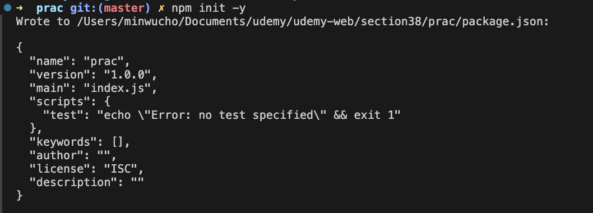
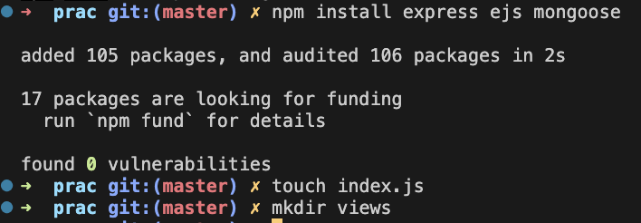

## Express 와 Mongoose 기본 설정

- 어떻게 프로젝트를 시작을 하나 알면 좋은 단원인 것 같음.




```js
//초기 index.js
const express = require("express");
const app = express();
const path = require("path");
const mongoose = require("mongoose");

mongoose
  .connect("mongodb://127.0.0.1:27017/movieApp")
  .then(() => {
    console.log("MONGO CONNECTION OPEN!!!");
  })
  .catch((err) => {
    console.log("OH NO MONGO CONNECTION ERROR!!!");
    console.log(err);
  });

app.set("views", path.join(__dirname, "views"));
app.set("view engine", "ejs");

app.get("/dog", (req, res) => {
  res.send("WOOF!");
});

app.listen(3000, () => {
  console.log("APP IS LISTENING ON PORT 3000!");
});
```

## 모델 만들기

- 일반적인 애플리케이션에는 수많은 모델이 존재함. 그래서 하나의 파일에서 모두 작성하기가 너무 어려움. 그리고 모델들이 서로를 참조하기 때문에 파일 분리하는게 좋음.

```js
const mongoose = require("mongoose");

const productSchema = new mongoose.Schema({
  name: {
    type: String,
    required: true,
  },
  price: {
    type: Number,
    required: true,
    min: 0,
  },
  category: {
    type: String,
    lowercase: true,
    enum: ["fruit", "vegetable", "dairy"],
  },
});

const Product = mongoose.model("Product", productSchema);

module.exports = Product;
```

- 데이터에 초기 데이터 심으면 좋음. 데이터가 전혀 없는 상태로 앱 만들기 힘듬.
- 개발을 위해서 별개로 DB 심는건 일반적인 일임.

```js
// seeds.js
const mongoose = require("mongoose");
const Product = require("./models/product");

mongoose
  .connect("mongodb://127.0.0.1:27017/farmStand")
  .then(() => {
    console.log("MONGO CONNECTION OPEN!!!");
  })
  .catch((err) => {
    console.log("OH NO MONGO CONNECTION ERROR!!!");
    console.log(err);
  });

const seedProducts = [
  {
    name: "Fairy Eggplant",
    price: 1.0,
    category: "vegetable",
  },
  {
    name: "Organic Goddess Melon",
    price: 4.99,
    category: "fruit",
  },
  {
    name: "Organic Mini Seedless Watermelon",
    price: 3.99,
    category: "fruit",
  },
  {
    name: "Organic Celery",
    price: 1.5,
    category: "vegetable",
  },
  {
    name: "Chocolate Whole Milk",
    price: 2.69,
    category: "dairy",
  },
];

Product.insertMany(seedProducts)
  .then((res) => {
    console.log(res);
  })
  .catch((e) => {
    console.log(e);
  });
```

- 위에서 하나라도 유효성 검사 통과 못하면 아무것도 삽입되지 않음.

## Products Index

- index.ejs 생성

```html
<!DOCTYPE html>
<html lang="en">
  <head>
    <meta charset="UTF-8" />
    <meta name="viewport" content="width=device-width, initial-scale=1.0" />
    <title>All Products</title>
  </head>

  <body>
    <h1>All Products!</h1>
    <ul>
      <% for(let product of products) { %>
      <li><%= product.name %></a></li>
      <% }%>
    </ul>
  </body>
</html>

```

- index.js 수정. async 하고 await 하는 라우트를 위한 비동기 콜백 패턴 확인. 매우 흔함.

```js
//index.js
app.get("/products", async (req, res) => {
  const products = await Product.find({});
  res.render("products/index", { products });
});
```

## Proudct Details

- 상품명으로 id를 했을 때 겹치는 물건 있을 수 있고 띄어쓰기와 문자가 URL에서 안전하지 않을 수 있는 문제 있어서 안됨.
- 아래와 같은 느낌으로

```html
<!DOCTYPE html>
<html lang="en">
  <head>
    <meta charset="UTF-8" />
    <meta name="viewport" content="width=device-width, initial-scale=1.0" />
    <title><%= product.name %></title>
  </head>

  <body>
    <h1><%= product.name %></h1>
    <ul>
      <li>Price: $<%= product.price%></li>
      <li>
        Category:
        <a href="/products?category=<%= product.category%>"
          ><%= product.category%></a
        >
      </li>
    </ul>
    <a href="/products">All Products</a>
  </body>
</html>
```

```js
app.get("/products/:id", async (req, res) => {
  const { id } = req.params;
  const product = await Product.findById(id);
  res.render("products/show", { product });
});
```

## 프로덕트 만들기

- 새로운 거는 없음 new 홈페이지에서 누르면 post로 만듬. 그다음에 redirect

```js
const categories = ["fruit", "vegetable", "dairy"];
app.get("/products/new", (req, res) => {
  res.render("products/new", { categories });
});

app.post("/products", async (req, res) => {
  const newProduct = new Product(req.body);
  await newProduct.save();
  res.redirect(`/products/${newProduct._id}`);
});
```

## 프로덕트 업데이트하기

- methodOvereride 이용
- findByIdAndUpdate 써서 save없이 update됨. updateOne(), updateMany(), findByIdAndUpdate(), findOneAndUpdate() 등은 데이터베이스에서 직접 업데이트를 수행하므로, save()를 호출할 필요가 없음. 인스턴스 받아서 직접 수정한 경우만 save() 필요

```js
app.get("/products/:id/edit", async (req, res) => {
  const { id } = req.params;
  const product = await Product.findById(id);
  res.render("products/edit", { product, categories });
});

app.put("/products/:id", async (req, res) => {
  const { id } = req.params;
  const product = await Product.findByIdAndUpdate(id, req.body, {
    runValidators: true,
    new: true,
  });
  res.redirect(`/products/${product._id}`);
});
```

- 이런식으로 코딩도 가능한거 확인
- const categories = ["fruit", "vegetable", "dairy"]; 을 index.js 에 써줬음.

```html
<% for(let category of categories){ %>
            <option value="<%=category%>" <%= product.category === category ? 'selected': '' %>><%=category%></option>
            <% } %>
```

## 프로덕트 삭제하기

```js
app.delete("/products/:id", async (req, res) => {
  const { id } = req.params;
  const deletedProduct = await Product.findByIdAndDelete(id);
  res.redirect("/products");
});
```

```html
<form action="/products/<%=product._id%>?_method=DELETE" method="POST">
  <button>Delete</button>
</form>
```

## 카테고리 별로 필터링하기

- category 없으면 (즉 쿼리 없으면) All로 보내준거 확인. 즉 기본 값이 All임.
- expresss는 위에서부터 라우팅 매칭 구체적인 것부터 써줘야함. 여기선 고정된 경로부터 써줘야함.

```js
app.get("/products", async (req, res) => {
  const { category } = req.query;
  if (category) {
    const products = await Product.find({ category });
    res.render("products/index", { products, category });
  } else {
    const products = await Product.find({});
    res.render("products/index", { products, category: "All" });
  }
});
```

- ejs에도 category가 All인지 체크해서 아니면 All로 가는 링크

```html
<!-- index.ejs -->
<!DOCTYPE html>
<html lang="en">
  <head>
    <meta charset="UTF-8" />
    <meta name="viewport" content="width=device-width, initial-scale=1.0" />
    <title>All Products</title>
  </head>

  <body>
    <h1><%= category%> Products!</h1>
    <ul>
      <% for(let product of products) { %>
      <li><a href="/products/<%=product._id%>"><%= product.name %></a></li>
      <% }%>
    </ul>
    <a href="/products/new">New Product</a>
    <%if(category !== 'All') {%>
    <a href="/products">All Products</a>
    <% } %>
  </body>
</html>
```
